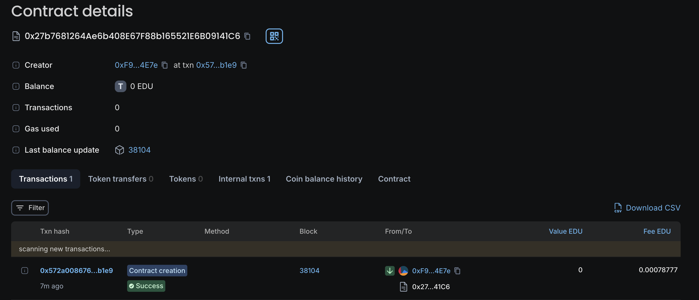

# Decentralized Course Reviews

## Vision

The vision of the Decentralized Course Reviews project is to create a transparent, decentralized platform where students can submit and share their honest reviews of educational courses. By leveraging blockchain technology, the project ensures that reviews are immutable and verifiable, fostering trust in the quality of educational content. Additionally, students are incentivized to participate by earning tokens for their contributions, creating a vibrant and engaged community.

## Project Features

- **Decentralized Review System**: Students can submit reviews for courses in a decentralized manner, ensuring transparency and trust.
- **Token Rewards**: Students are rewarded with tokens for submitting reviews, incentivizing participation and honest feedback.
- **Immutability**: Once a review is submitted, it is stored on the blockchain, making it tamper-proof and ensuring its authenticity.
- **Review Verification**: The smart contract ensures that a student cannot submit multiple reviews for the same course, maintaining the integrity of the review system.
- **Token Balance View**: Students can view their accumulated token balance, which reflects their contributions to the platform.

## Future Scope

- **Review Rating System**: Implement a feature where other students can rate the usefulness of reviews, providing additional insights into course quality.
- **Token Utilization**: Expand the token ecosystem, allowing students to use earned tokens for discounts on courses, certifications, or other educational resources.
- **Cross-Platform Integration**: Integrate with existing educational platforms to pull course data and enable seamless review submission.
- **Reputation System**: Develop a reputation system for students based on their review history and the ratings their reviews receive.
- **Decentralized Governance**: Introduce decentralized governance where token holders can vote on platform updates, token rewards, and other key decisions.

## Project Structure

- **Smart Contract**:
  - `DecentralizedCourseReviews.sol`: The main smart contract handling course reviews, token rewards, and review verification.
- **Mappings**:
  - `courseReviews`: Stores reviews submitted by students for each course.
  - `studentTokens`: Tracks the token balance for each student.
  - `courseTokenRewards`: Defines the token reward for submitting a review for a particular course.
- **Structs**:
  - `Review`: A structure that holds the review content and the timestamp of submission.
- **Events**:
  - `SubmitReview`: Triggered when a student submits a review.
  - `EarnTokens`: Triggered when a student earns tokens for submitting a review.

## Developer Details

- **Name**: Akshay
- **Email**: Mukkera9024@gmail.com
- **GitHub**: https://github.com/Akshay9024

## Getting Started

1. **Prerequisites**:
   - Ensure you have a working knowledge of Solidity and smart contract development.
   - Set up a local Ethereum development environment (e.g., using Truffle or Hardhat).
2. **Deployment**:
   - Deploy the `DecentralizedCourseReviews` contract on a testnet.
3. **Interacting with the Contract**:
   - Use Remix or a web3-enabled interface to interact with the contract functions.

## Deployment

- **Chain Name** : Decentralized Course Reviews
- **Contract ID** : 0x27b7681264ae6b408e67f88b165521e6b09141c6

  

## License

The Decentralized Course Reviews project is licensed under the MIT License.
